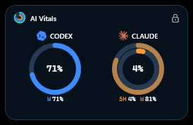
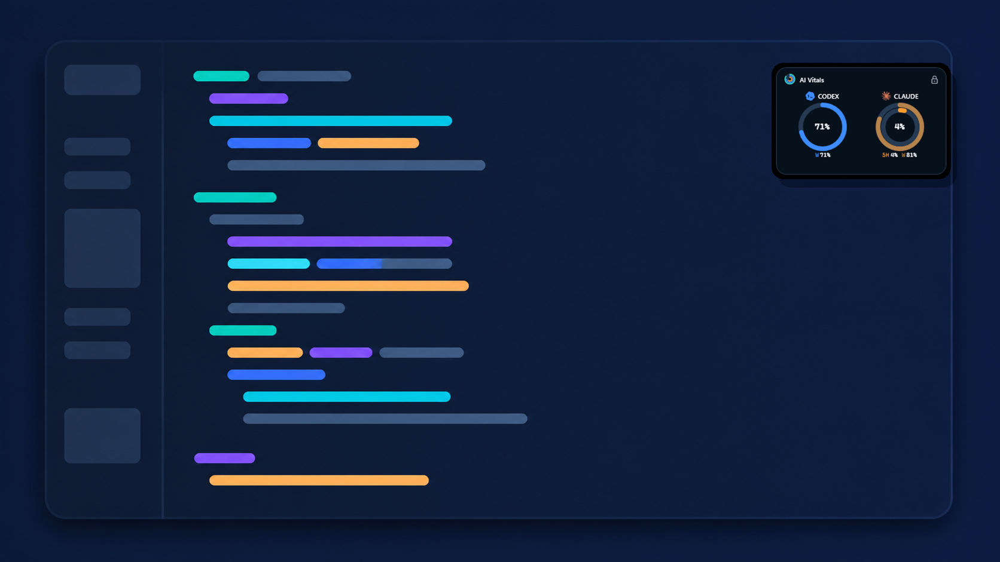
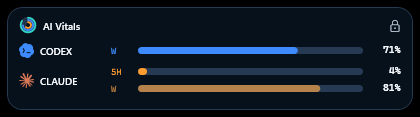
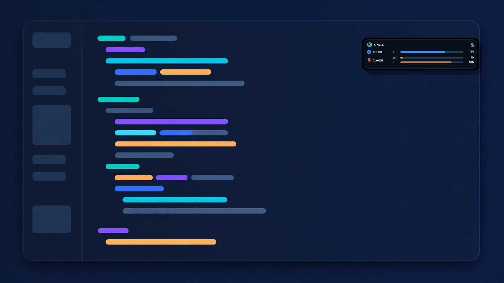
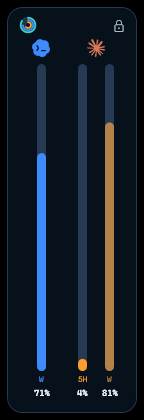
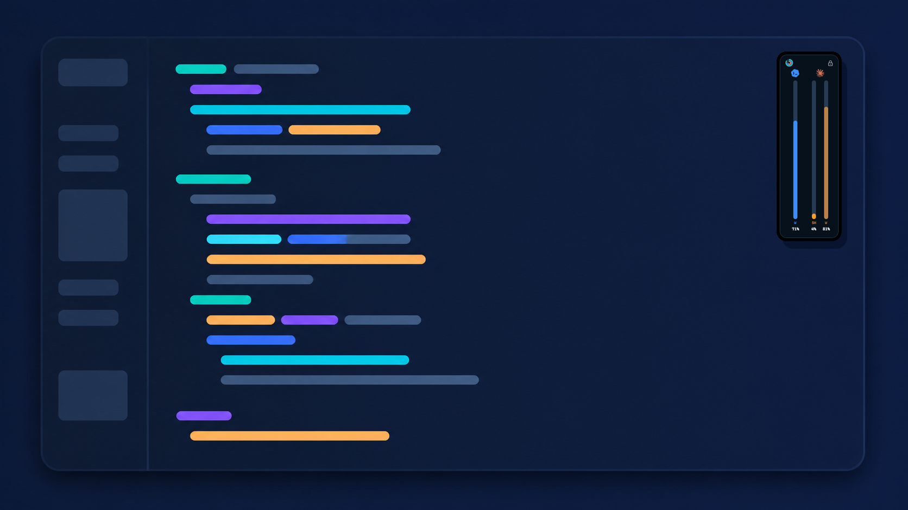
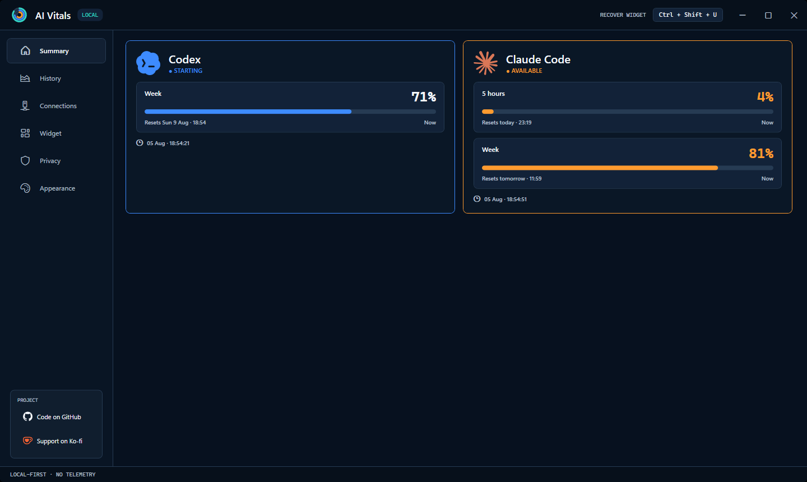
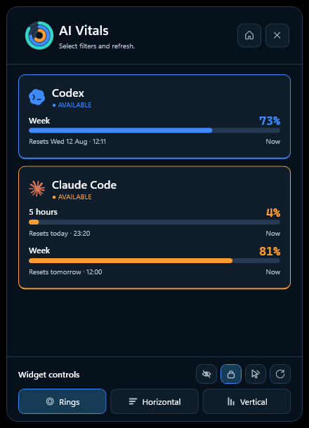
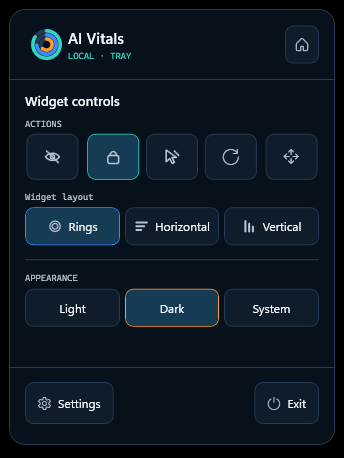

<div align="center">


# AI Vitals

**A private, local-first Windows companion for monitoring AI coding assistant usage.**


[Overview](#overview) · [Screenshots](#screenshots) · [Features](#features) · [Getting started](#getting-started) · [Privacy](#privacy) · [Documentation](#documentation)

</div>

## Overview

AI Vitals keeps Codex and Claude Code usage within sight without interrupting your workflow. It runs as a lightweight Windows tray application and presents real provider data through an always-on-top widget, a quick-status popup, and a full dashboard.

The application has no account system, cloud backend, or telemetry. Usage observations, preferences, and history remain on the local machine.

> [!NOTE]
> AI Vitals displays only metrics published by each provider. Missing, expired, or stale data is labelled honestly and is never converted into a synthetic zero.

## Screenshots

AI Vitals provides three compact widget layouts for different workspaces. For every layout below, the left image is an unedited capture of the real application window; the right image places that same capture over an AI-generated, privacy-safe cartoon editor to demonstrate its on-screen footprint.

### Activity rings

<table>
  <tr>
    <td width="28%" align="center">
      <br />
      <sub>Real widget capture</sub>
    </td>
    <td width="72%" align="center">
      <br />
      <sub>Real widget over a generated cartoon workspace</sub>
    </td>
  </tr>
</table>

### Horizontal bars

<table>
  <tr>
    <td width="28%" align="center">
      <br />
      <sub>Real widget capture</sub>
    </td>
    <td width="72%" align="center">
      <br />
      <sub>Real widget over a generated cartoon workspace</sub>
    </td>
  </tr>
</table>

### Vertical bars

<table>
  <tr>
    <td width="28%" align="center">
      <br />
      <sub>Real widget capture</sub>
    </td>
    <td width="72%" align="center">
      <br />
      <sub>Real widget over a generated cartoon workspace</sub>
    </td>
  </tr>
</table>

### Full dashboard



This is a direct capture of the running application with active, non-zero Claude Code quota windows, cropped to the exact window boundary.

### Tray interactions

<table>
  <tr>
    <td width="56%" align="center">
      <br />
      <sub>Left click: live quota status and widget shortcuts</sub>
    </td>
    <td width="44%" align="center">
      <br />
      <sub>Right click: widget, appearance, and application controls</sub>
    </td>
  </tr>
</table>

Both images are direct captures of the running application, cropped to their exact window boundaries.

## Features

- **Live provider monitoring** for Codex and Claude Code through local integrations.
- **Three widget layouts**: activity rings, horizontal bars, and vertical bars.
- **Tray-first workflow** with quick status, dashboard access, and widget controls.
- **Usage history** with provider and date filters, backed by SQLite.
- **CSV and JSON export** for the exact data currently in view.
- **Automatic freshness handling** for active, delayed, stale, and expired observations.
- **English and Spanish UI**, light/dark/system themes, and Windows high-contrast support.
- **Multi-monitor recovery** with `Ctrl+Shift+U` when a widget is off-screen or click-through is enabled.
- **Local-first privacy** with no prompts, responses, transcripts, project paths, or raw session identifiers stored.

## How it works

| Layer | Responsibility |
| --- | --- |
| Provider adapters | Read structured usage data from Codex and Claude Code. |
| Application core | Normalizes observations without merging incompatible quota windows. |
| Local storage | Stores detailed observations in SQLite and preferences in JSON. |
| Windows UI | Presents the tray menu, quick popup, dashboard, and configurable widget. |

Codex data comes from the local `codex app-server`. Claude Code quotas come from its local OAuth usage endpoint, while the optional reversible `statusLine` bridge provides session telemetry. The deterministic fake adapter is retained for automated tests.

## Install

Download the installer for your architecture from the [latest release](https://github.com/AlexAdiaconitei/ai-vitals/releases/latest):

| Architecture | Installer |
| --- | --- |
| Windows x64 | `AIVitalsApp-win-x64-Setup.exe` |
| Windows on ARM (ARM64) | `AIVitalsApp-win-arm64-Setup.exe` |

The installer is self-contained, so no .NET runtime is required, and it installs for the current user under `%LOCALAPPDATA%\AIVitalsApp` without an administrator prompt.

Releases are not code signed yet, so Windows SmartScreen shows a warning on first run. Choose **More info**, then **Run anyway**. Every release publishes a `SHA256SUMS.txt` asset and a checksum table in its notes; verify the download before running it:

```powershell
Get-FileHash .\AIVitalsApp-win-x64-Setup.exe -Algorithm SHA256
```

### Updates

AI Vitals checks the published releases when it starts and once a day afterwards, downloads a new version in the background, and installs nothing until you choose **Install and restart** from the About section or the tray menu. Automatic checking can be turned off in **About**, where a manual check is always available. Pre-releases are never offered to stable installations.

### Uninstall

Uninstall AI Vitals from **Settings → Apps → Installed apps**. Uninstalling restores the Claude Code `statusLine` to its previous configuration and removes the startup entry. Local usage history and settings are kept in `%LOCALAPPDATA%\AIVitals`; delete that folder to remove them, or use **Privacy → Delete all data** before uninstalling.

## Getting started

### Requirements

- Windows 10 22H2 or Windows 11
- [.NET SDK 9](https://dotnet.microsoft.com/download/dotnet/9.0) to build from source
- Codex and/or Claude Code installed and signed in locally for live provider data

### Run from source

```powershell
dotnet restore AIVitals.sln
dotnet run --project src/AIVitals.App/AIVitals.App.csproj
```

AI Vitals starts in the notification area. Left-click the tray icon for quick status, or open the context menu for the dashboard and widget controls. Choosing **Exit** stops the adapters and closes the resident process.

### Widget controls

Use the tray menu to show or hide the widget, change its layout, lock its position, or enable click-through. Drag any free area to move it; the widget snaps to the current monitor's work area and restores its last position at startup.

Press `Ctrl+Shift+U` to recover the widget. This makes it visible, disables click-through, unlocks it, and moves it to the monitor containing the pointer.

## Privacy

AI Vitals is designed around data minimization:

- no application account, backend, or analytics;
- no prompts, responses, conversation content, transcript files, or project paths;
- no provider credentials copied into application storage;
- Claude Code session identifiers are pseudonymized locally with HMAC;
- raw Claude Code payloads are discarded after allowlisted fields are extracted;
- exports happen only when explicitly requested.

Local data is stored under `%LOCALAPPDATA%\AIVitals`. Development and verification overrides use `AI_VITALS_DATA_DIRECTORY`.

## Development and verification

Run the full automated test suite:

```powershell
dotnet test AIVitals.sln
```

Run one real Windows quality-matrix cell after publishing for the native architecture:

```powershell
.\scripts\verify-windows-quality-matrix.ps1 `
  -ExecutablePath .\artifacts\win-x64\AIVitals.App.exe `
  -ExpectedOs Windows11 `
  -ExpectedArchitecture X64 `
  -ExpectedScale 100
```

Each matrix run covers the six language/theme combinations, checks localized accessible names through UI Automation, and writes PNG screenshots plus JSON evidence to `artifacts/quality-matrix`.

Build an installer locally, exactly as the release workflow does:

```powershell
dotnet tool install -g vpk --version 1.2.0
.\scripts\extract-changelog-notes.ps1 -Version 0.1.0 -OutputPath artifacts\release-notes.md
.\scripts\pack-release.ps1 -Version 0.1.0 -Runtime win-x64 -ReleaseNotesPath artifacts\release-notes.md
```

Publishing is driven by tags: pushing `v0.1.0` runs [.github/workflows/release.yml](.github/workflows/release.yml), which refuses to build unless `CHANGELOG.md` has a section for that version, builds both architectures, and publishes them as one GitHub release. A tag with a hyphen, such as `v0.1.1-beta.1`, is published as a pre-release and reuses the notes written for `0.1.1`. See [docs/release-checklist.md](docs/release-checklist.md) for the manual verification each stable release needs.

## Project status

The domain model, local persistence, live Codex and Claude Code adapters, widget, quick popup, dashboard, history, export, localization, themes, accessibility support, and the installer and update channel are implemented. The remaining release gates are the full Windows 10/11, x64/ARM64, and 100/150/200% DPI matrix documented in [docs/quality-matrix.md](docs/quality-matrix.md), and the clean-machine checks in [docs/release-checklist.md](docs/release-checklist.md).

## AI-assisted development

The AI Vitals codebase was created with AI assistance through **Codex, powered by GPT-5.6-Sol** and **Claude Code, powered by Opus 5**. Product direction, architecture, implementation, tests, documentation, and visual refinement were developed through an iterative, human-directed workflow.

## Documentation

- [Changelog](CHANGELOG.md)
- [Design system](DESIGN.md)
- [Provider adapter guide](docs/future-adapters.md)
- [Windows quality matrix](docs/quality-matrix.md)
- [Release checklist](docs/release-checklist.md)
- [Claude Code `statusLine` research](docs/research/claude-code-statusline.md)
- [Domain language](plan/CONTEXT.md)
- [Validated product plan](plan/round-03-plan-final-validado.html)
- [Distribution plan](plan/round-04-distribucion-github-releases.html)

## About Me

**AlexAdiaconitei** — [Software engineer specialized in backend development with Java and Spring Boot, comfortable working with JavaScript and Python. I enjoy building personal projects to keep learning, with a growing interest in infrastructure.]

- GitHub: [@AlexAdiaconitei](https://github.com/AlexAdiaconitei)
- LinkedIn: [Alex Adiaconitei](https://www.linkedin.com/in/alexadiaconitei/)
