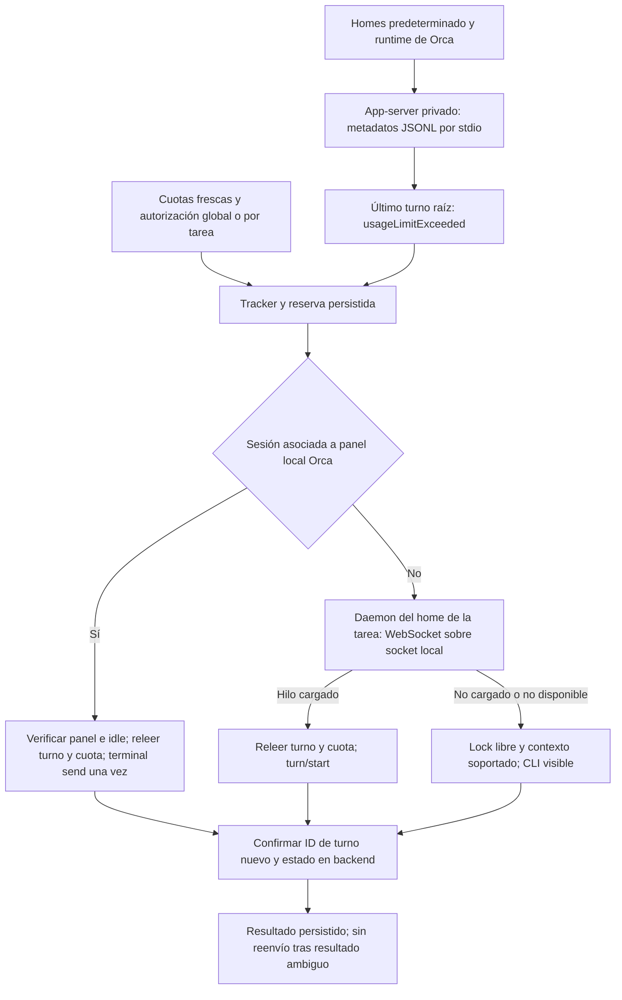

# Verificación de arquitectura: reanudar Codex tras agotar cuota

Actualizado: 2026-10-05. Versión preparada: 0.3.0. Codex CLI 0.160.0, Orca 1.4.219, Windows y .NET 9.

La investigación encontró tres causas. El socket del daemon espera WebSocket con HTTP Upgrade y el proxy de bytes de Codex no transforma JSONL en ese protocolo. Además, el tracker desarmaba tareas descubiertas tarde sin ventana de reset observada. Los logs reales mostraban `Ready`, `armed: false`, ventanas vacías y ningún intento pese a estar habilitada la automatización. Finalmente, AI Vitals consultaba el home predeterminado mientras los terminales de Orca usan otro `CODEX_HOME` y no estaban conectados al daemon consultado.

## Flujo implementado

Cada tarea conserva el home del que procede. Ese home se usa para validar turno y cuota, elegir el socket, comprobar el lock y lanzar `codex resume --no-daemon`. El historial actual de Orca sustituye copias antiguas del mismo hilo en el home predeterminado, incluso cuando ya se completó. Un fallo al leer metadata no autoriza usar una copia vieja para ejecutar.

El controlador serializa escaneo, cambios de autorización y ejecución. Persiste la reserva antes de enviar input. Una interrupción durante el envío deja el bloqueo sin reenvío automático tras reiniciar. Un lease exclusivo impide dos instancias sobre el mismo directorio de datos.

## Contratos y rutas

| Parte | Decisión y comprobación |
|---|---|
| Transporte | Stdio usa JSONL. El control socket usa HTTP Upgrade y tramas WebSocket. Se probaron negociación, fragmentación y conexiones al daemon instalado sin detenerlo. |
| Inicialización | `initialize`, capacidades experimentales y `initialized` preceden las peticiones. El handshake tiene presupuesto independiente de cinco segundos. |
| Detección | `thread/list` pagina con fuentes explícitas. `thread/turns/list`, `limit: 1` y `itemsView: notLoaded` leen el último turno sin cargarlo para ejecución. Los fallos se aíslan por hilo. |
| Cuota | `ordinaryUsageAllowed` debe ser `true`. Una fecha de reset o un porcentaje no bastan; ausencia, null, ventanas caducadas o lecturas parciales impiden ejecutar. Se vuelve a leer cuota en cada ruta. |
| Orca | CLI pública y metadata local de hooks v2 asocian sesión, transcript, worktree, tab y leaf exactos. Se exige host local, panel conectado y escribible, encarnación intacta, `tui-idle` y compositor vacío. Después se revalidan turno y cuota. |
| Envío Orca | `terminal send --wait-submit` se ejecuta una sola vez. Una aceptación de input no acredita un turno: se exige otro ID y estado `inProgress` o `completed` en el backend. Pérdidas de respuesta quedan como resultado desconocido. |
| Daemon | Se verifica hilo cargado y mismo fallo por cuota. `active` no recibe otro prompt. `idle` y `systemError` continúan tras revalidación, sin introducir overrides de configuración. |
| Terminal nueva | Se reproduce cwd, modelo, esfuerzo, aprobaciones y sandbox soportado. Los argumentos se envían directamente sin shell. Un perfil que no pueda representarse fielmente se rechaza. |
| Permisos | No se combinan `permissions` y `sandbox` por RPC. Pruebas nativas confirman overrides legacy read-only/workspace-write frente a un perfil global distinto. La ruta Orca conserva los permisos del proceso original. |
| Aprobaciones | AI Vitals no aprueba herramientas. Las solicitudes del servidor se distinguen de respuestas; la CLI original o la terminal visible mantienen la interacción del usuario. |
| Persistencia | Preferencias atómicas v5, reserva previa, exclusiones explícitas y contadores durables. Los diagnósticos rotan y guardan metadata allowlisted, sin prompts, títulos, rutas ni credenciales. |

La metadata `agent-hooks/last-status.json` es de Orca y no forma parte de la API de OpenAI. La integración reconoce únicamente versión 2; cambios de formato o asociaciones ambiguas no autorizan input. Solo se consideran terminales locales. Se lee temporalmente el archivo de hooks y la pantalla del terminal para comprobar la asociación y el compositor; no se persisten sus prompts, respuestas ni salidas. Un borrador o modal bloquea el envío. Si faltan estos datos y el hilo conserva un lock, espera a su propietario.

## Reglas para tareas pendientes

- La opción global incluye tareas pendientes y fallos nuevos. Un interruptor por tarea guarda exclusión explícita. Apagar la opción global no convierte todas las tareas en exclusiones manuales. La migración desde v4 conserva la opción apagada.
- Si no se observó el reset original, cuotas completas y frescas más autorización del backend permiten continuar. No se inventa una fecha histórica ni se asigna una ventana semanal ajena.
- Una ventana bloqueante guardada exige su reset más sesenta segundos y lectura completa posterior. Reiniciar o despertar tarde no elimina la autorización.
- Los inicios se separan dos minutos; no existe un tope fijo de tres tareas. Las esperas por lock o cuota se reintentan cada cinco minutos dentro del horizonte de ocho días. El escaneo se mantiene cada tres minutos con automatización habilitada.
- Un panel Orca puede continuar sin daemon compartido. Otros procesos o ChatGPT Desktop pueden retener un hilo fuera de las rutas disponibles; AI Vitals espera sin quitarles el lock.
- El mismo turno confirmado o ambiguo no se vuelve a enviar. Tras inicio confirmado, otro fallo por cuota en un turno posterior puede armarse. Una reserva ambigua previa bloquea automatización de ese hilo.
- Las preferencias v5 antiguas no distinguían exclusión manual y desarme automático. Se conservan las entradas desarmadas con ventana conocida; las entradas sin ventana, que aquella UI no permitía editar, se recuperan bajo la autorización global.

## Validación y límites

La consolidación de worktrees del 2026-10-05 repitió la compilación Release sin avisos,
la comprobación del bridge y 257 pruebas sin sesiones externas: 135 unitarias,
29 de integración y 93 de contratos. Se excluyeron las nueve pruebas etiquetadas
`Live` o `Native`; no se volvió a ejecutar la evidencia live descrita más abajo.
Los resultados de esta revisión están en `artifacts/validation/worktree-consolidation-full_*.trx`.
El arranque residente x64 con datos temporales también pasó. La [checklist de release](release-checklist.md)
registra la auditoría NuGet, los checksums y lo pendiente antes de una versión estable.

La suite habitual supera 266 pruebas: 101 de contratos, 30 de integración y 135 unitarias. Se ejecutan aparte ocho comprobaciones nativas/live con las variables habilitadas y un replay de preferencias reales. Evidencia: `minor-030-release.trx`, `minor-030-native.trx` y `codex-pending-real-data.trx` en `TestResults`.

Las 18 regresiones Orca cubren selección exacta con varios terminales, home y transcript, host remoto, sesiones duplicadas, versión desconocida, borradores, modales, panel sustituido, cuota denegada, tarea ya completada y respuesta perdida sin reenvío. El test live confirma asociaciones reales y lectura de turnos en el home de Orca, sin enviar input. Al ejecutarlo no había un último turno con fallo por cuota en ese historial; los paneles consultados tenían turnos persistidos completados o interrumpidos. No se afirma haber reanudado tareas reales en esa prueba.

El replay del home predeterminado selecciona un exec antiguo de prueba bajo cuota recuperada. Su contexto administrado no es soportado por el launcher: selección no equivale a ejecución. Esa prueba valida exclusivamente la recuperación de autorización y se detiene antes de reservar o enviar.

Una comparación aislada del controlador WPF usa dispatcher STA, preferencias temporales, cuotas en memoria y Codex simulado. El binario anterior produjo `Ready`, desarmado y cero intentos; el nuevo produjo una reserva, un único lanzamiento, otro turno confirmado y `Launched`. Fixtures y resultados: `artifacts/0.3.0/smoke-harness`. No contienen tareas reales.

Los paquetes finales están en `artifacts/0.3.0/releases-final` y los binarios verificados en `publish-final`; `verification.json` y `SHA256SUMS.txt` corresponden a esos paquetes. Las carpetas de ensayos anteriores no son los entregables. La preparación local incluye notas, publicaciones autocontenidas e instaladores Velopack x64/ARM64, con versiones, arquitecturas y SHA256 verificados. Construir ARM64 no acredita instalación o ejecución en hardware ARM64. No se publica un tag ni release en esta preparación.

La instancia abierta durante la investigación ejecutaba una compilación Debug anterior. Preparar 0.3.0 no cambia sus DLL cargadas. Debe cerrarse antes de iniciar la compilación nueva o instalar el paquete. No se ha instalado ni reiniciado la instancia del usuario durante esta revisión.

Queda por observar un reset real con esta compilación y una tarea bloqueada en Orca. Las comprobaciones automatizadas no sustituyen ese ciclo completo. También queda una carrera entre el último chequeo y una acción manual concurrente: `turn/start` no tiene una precondición documentada que compare el turno anterior. La reserva local reduce duplicados de AI Vitals, sin convertir esa operación en una transacción entre clientes. Parte del protocolo es experimental y puede cambiar.

## Fuentes

- [OpenAI: Codex App Server](https://learn.chatgpt.com/docs/app-server): transportes, inicialización, historial, cuotas, resume, turn/start y aprobaciones.
- [OpenAI: referencia de configuración](https://learn.chatgpt.com/docs/config-file/config-reference): `CODEX_HOME`, permisos y sandbox.
- Esquemas locales generados con `codex app-server generate-json-schema` para CLI 0.160.0.
- Guía de Orca 1.4.219 obtenida mediante `orca skills get orca-cli`: metadata de terminales, waits, recibos de envío y ausencia de reenvío ante ambigüedad.
